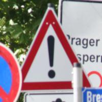
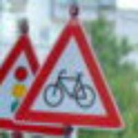
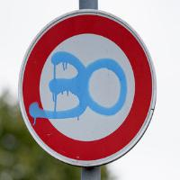
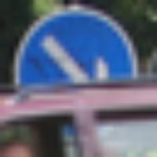

## Project: Build a Traffic Sign Recognition Program

[//]: # (Image References)

[image1]: ./readme_images/visualization.jpg "Visualization"
[image2]: ./readme_images/new_visualization.jpg "New Visualization"
[image3]: ./readme_images/grayscale.jpg "Grayscaling"
[image4]: ./readme_images/CLAHE.jpg "CLAHE"
[image5]: ./readme_images/augmentation.jpg "Augmentation"
[image6]: ./readme_images/loss.png "Loss"
[image7]: ./readme_images/accuracy.png "Accuracy"
[image8]: ./readme_images/softmax1.jpg "Softmax 1"
[image9]: ./readme_images/softmax2.jpg "Softmax 2"
[image10]: ./readme_images/softmax3.jpg "Softmax 3"
[image11]: ./readme_images/softmax4.jpg "Softmax 4"
[image12]: ./readme_images/softmax5.jpg "Softmax 5"

Overview
---
In this project, I make use of deep neural networks and convolutional neural networks to classify traffic signs. I train and validate a model so it can classify traffic sign images using the [German Traffic Sign Dataset](http://benchmark.ini.rub.de/?section=gtsrb&subsection=dataset). After the model is trained, new images of German traffic signs from the web are predicted from the model.

Here is a link to my [project code](./Traffic_Sign_Classifier.ipynb) in an Ipython notebook with a detailed description of the project steps.

---

Table of contents
---
* [Data Set Summary & Exploration](#data-set-summary--exploration)
* [Preprocessing](#preprocessing)
* [Model Architecture](#model-architecture)
* [Training](#training)
* [Testing](#testing)

Data Set Summary & Exploration
---

Here are the summary statistics of the traffic
signs data set:
* The size of training set is 34799
* The size of the validation set is 4410
* The size of test set is 12630
* The shape of a traffic sign image is (32, 32, 3)
* The number of unique classes/labels in the data set is 43

Here is an exploratory visualization of the data set. It is a bar chart showing how the data is distributed over all possible classes:

![alt text][image1]

I have performed data augmentation on the training set because we have more images of some classes than others. It is a good idea to have an equal distribution of examples over all possible classes to be able to predict all of them.

Moreover, if we add more examples to our dataset, this will also help prevent overfitting.

The distribution of examples after performing data augmentation looks like this:

![alt text][image2]

Preprocessing
---
First pre-processing step was grayscaling. Here's an example of a traffic sign image before and after grayscaling:

![alt text][image3]

After grayscaling, I decided to use CLAHE (Contrast Limited Adaptive Histogram Equalization) to account for different lighting conditions.

Here is an example of CLAHE applied after grayscaling:

![alt text][image4]

As a last step, I normalized the image data so that it has zero mean and equal variance.

#### Data Augmentation

To add more data to the the training set, I applied changes in rotation, shear, zoom & brightness randomly to classes with less number of examples.

Here is an example of an original image and an augmented image:

![alt text][image5]

The difference between the original data set and the augmented data set is the distribution of examples over all possible classes (both bar charts can be seen above) as well as going from 34799 examples in the original training set to 92053 examples in the new training set which is going to prevent overfitting and generalize to different lighting conditions like seen in the augmented example.

Model Architecture
---
My final model consisted of the following layers:

| Layer                             | Description                                           |
|:---------------------------------:|:-----------------------------------------------------:|
|               Input               |               32x32x1 Preprocessed Image              |
|          Convolution 5x5          |       1x1 stride, same padding, outputs 32x32x16      |
|                RELU               |                                                       |
|          Convolution 5x5          | 1x1 stride, same padding, outputs 32x32x16            |
|                RELU               |                                                       |
|          Max pooling (1)          |              2x2 stride, outputs 16x16x16             |
|          Convolution 3x3          |       1x1 stride, same padding, outputs 16x16x32      |
|                RELU               |                                                       |
|          Convolution 3x3          |       1x1 stride, same padding, outputs 16x16x32      |
| Shortcut connect. Convolution 1x1 | From (1) 1x1 stride, valid padding, outputs 16x16x32  |
|                RELU               |                                                       |
|          Max pooling (2)          |               2x2 stride, outputs 8x8x32              |
|          Convolution 3x3          |        1x1 stride, same padding, outputs 8x8x64       |
|                RELU               |                                                       |
|          Convolution 1x1          |       1x1 stride, valid padding, outputs 8x8x64       |
| Shortcut connect. Convolution 1x1 |   From (2) 1x1 stride, valid padding, outputs 8x8x64  |
|                RELU               |                                                       |
|            Max pooling            |               2x2 stride, outputs 4x4x64              |
|              Flatten              |                      outputs 1024                     |
|              DROPOUT              |                                                       |
|                FC 1               |                   1024 hidden units                   |
|                RELU               |                                                       |
|              DROPOUT              |                                                       |
|                FC 2               |                    256 hidden units                   |
|                RELU               |                                                       |
|              DROPOUT              |                                                       |
|                FC 3               |                    43 output units                    |
|              DROPOUT              |                                                       |
|              SOFTMAX              |             outputs softmax probabilities             |

Training
---
To train the model, I used Adam optimizer with a learning rate of 0.001.

I have used regularization while training. Concretely, I have used L2 regularization in the Convolutional layers and Dropout in the fully connected layers. The regularization parameter used for L2 regularization is 0.0005. For Dropout, I have used a 0.5 keeping probability.

I have trained the network for a total number of 50 epochs with a batch size of 512.

For evaluation, the categorical cross entropy loss is used and a calculation of Loss & Accuracy for both training and validation is performed after each epoch.

My final model results were:
* training set accuracy of 100 %
* validation set accuracy of 99.1 %
* test set accuracy of 98 %

Here are the loss and accuracy plots for training and validation during the training process:

![alt text][image6] ![alt text][image7]

Testing
---
Here are five German traffic signs that I found on the web:

    

The first two images might be difficult to classify because other sign types are presented in the background.

The third image (Stop sign) and the last image might be also difficult to classify because they are partially covered.

Finally, the fourth image is an image with a graffiti painted on it. It is very common to see traffic signs with graffitis or other paintings so this could also be another difficulty for the classifier. Concretely, in this image the graffiti represents another traffic sign (Speed limit 30km/h).

#### Model's predictions

Here are the results of the prediction:

| Image             | Prediction        |
|:-----------------:|:-----------------:|
| General Caution   | General Caution   |
| Bicycles crossing | Bicycles crossing |
| Stop              | Stop              |
| No vehicles       | No vehicles       |
| Keep right        | Keep right        |

The model was able to correctly guess 5 of the 5 traffic signs, which gives an accuracy of 100%. This compares favorably to the accuracy on the test set of 98%.

The model was trained to predict partially covered signs as well as images with other signs on the background because the training set contains some examples with these situations so it should be able to predict the traffic signs pretty well in these circumstances.

However, the 'No vehicles' traffic sign with the graffiti painted on it has never seen it before and was also able to predict it correctly so we could say that the model is performing well on classifying images that it was not specifically trained for.

#### Top 5 softmax probabilities

Here are the top 5 softmax probabilities for each image represented as bar charts.

##### Image 1

![alt text][image8]

##### Image 2

![alt text][image9]

##### Image 3

![alt text][image10]

##### Image 4

![alt text][image11]

Here is interesting to see how the model is also predicting speed limit signs which is what the graffiti is trying to represent. However, the 30km/h sign is surprisingly not included in the top 5 probabilities.

##### Image 5

![alt text][image12]
